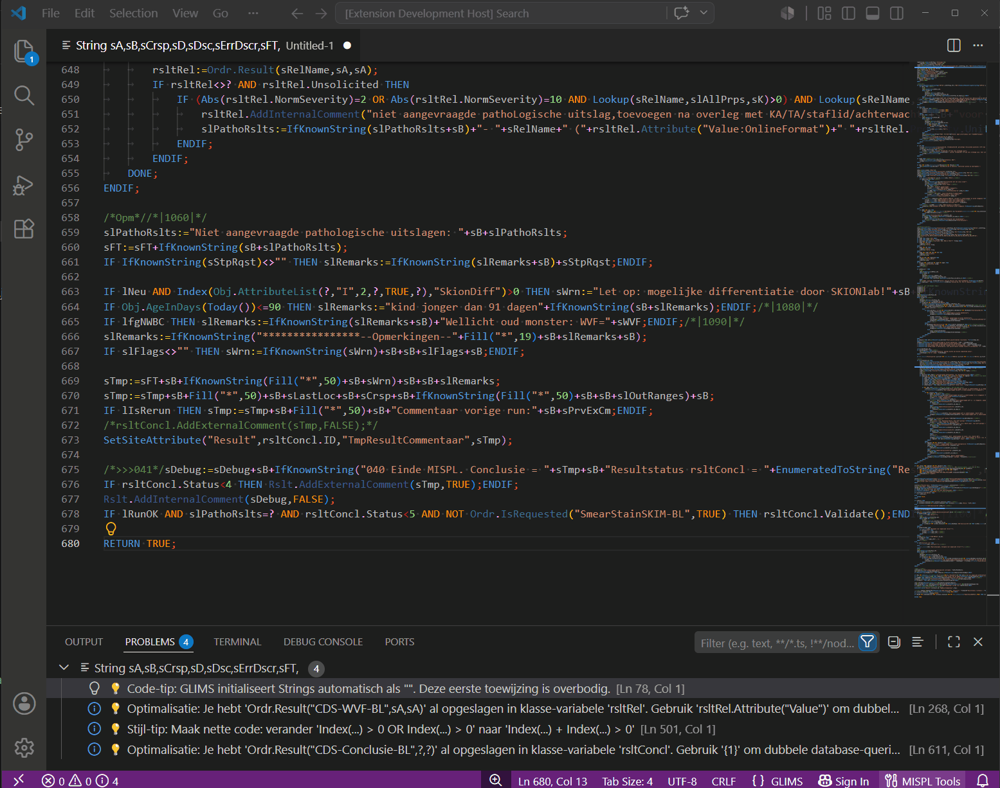
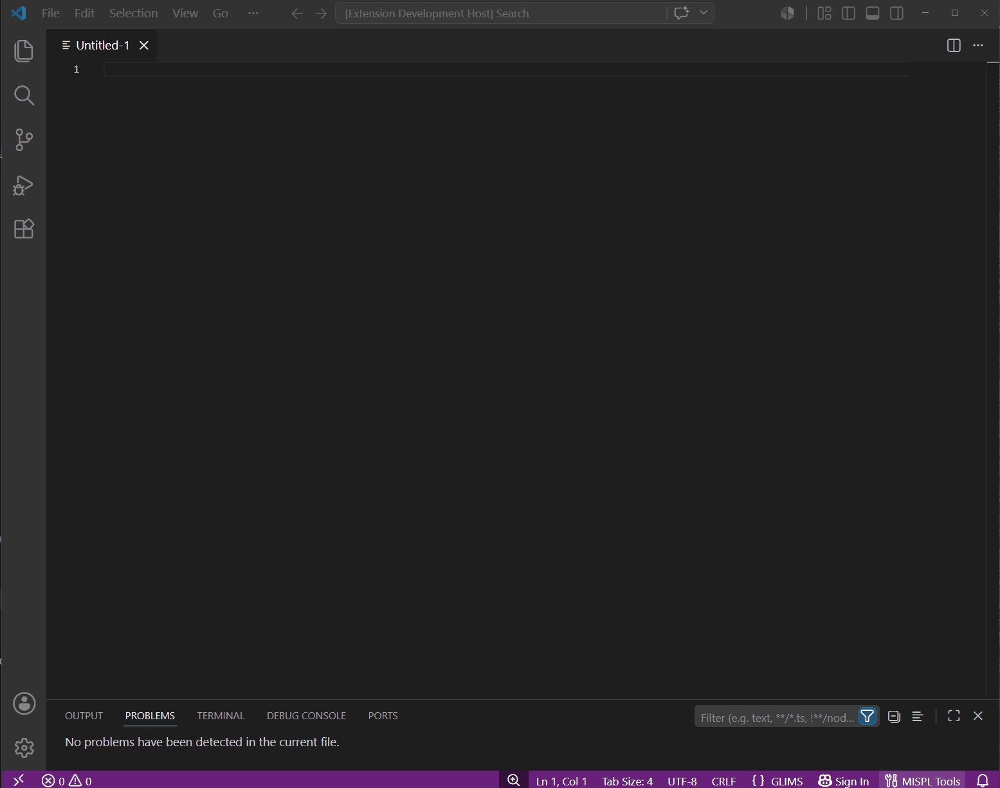

# MISPL Language Support for Visual Studio Code

**MISPL** (*MIPS Scripting Language*) is a powerful scripting language used to customize and extend the **Clinisys GLIMS** Laboratory Information System. This extension brings modern IDE features to VS Code, making MISPL development faster, cleaner, and less prone to errors.

> [!IMPORTANT]  
> **Independent Development:** This module is an independently developed third-party tool. Clinisys does not provide technical support for this extension and is not responsible for any errors caused by its use.

---

## ✨ Key Features & Tools

### 🧠 Intelligent Coding & Navigation
Write code faster with smart suggestions, context-aware hovers, and instant error detection.

  
<b>🔍 Hover, Linting & Quick Fixes</b>

   
  Hovering over a variable shows its type, its last assignment, and how many times it is present. In the Problems window, Errors, Warnings, and Style-tips are shown. Using the right mouse menu (or the Quick Fix lightbulb) shows an automatic quick fix in many cases.  
  

  
<b>💡 IntelliSense (Snippets)</b>

   
  Hover over any standard GLIMS function (e.g., <code>AddLogEntry</code>) to instantly view parameter requirements and documentation. Use smart autocomplete snippets to build complex blocks in seconds.  
  

  
<b>🗺️ Code-Map (Outline)</b>

   
  Navigate complex scripts easily with the Outline panel. View declared variables by type and jump directly to specific <code>IF</code> and <code>WHILE</code> blocks.  
  

### 🛠️ Refactoring & Formatting
Keep your codebase clean, readable, and perfectly structured with automated tools.

  
<b>🧹 Remove Unused Variables</b>

   
  Automatically scans your declarations and surgically removes variables that are never used in the script.  
  

  
<b>📏 Align Assignments</b>

   
  Select a block of code and align all <code>:=</code> operators vertically for maximum readability.  
  

  
<b>📦 Wrap in Block</b>

   
  Instantly wrap selected lines of code in an <code>IF</code>, <code>WHILE</code>, or <code>REPEAT</code> block with proper indentation (Shortcut: <code>Ctrl+Alt+W</code>).  
  

  
<b>✂️ Extract to Variable</b>

   
  Select a complex expression, right-click, and extract it to automatically declare and assign a new variable at the top of your script.  
  

  
<b>📝 Format, Compact & Minify</b>

   
  Format your code perfectly, remove redundant whitespace, or aggressively minify your script to stay under the GLIMS 31,000-character limit.  
   
   
  

---

## ⚙️ Extension Settings

Use `File > Preferences > Settings` to open the settings window. Search for `MISPL` to find specific settings items such as language, or the type of desired formatting for your MISPLs.

  
<b>⚙️ View Settings Panel</b>

   
  

*   **`mispl.language`**: Set the language for the linter, pop-ups, and Quick Fixes (Auto, English, Dutch, French, or German).
*   **`mispl.formattingStyle`**: Choose between the Standard format or the Clinisys Multi-line format (which places `THEN`, `DO`, and `UNTIL` on new lines).
*   **`mispl.glimsUsername`**: Your personal GLIMS login name, used to generate safe, user-targeted debug messages.
*   **`mispl.customDictionary`**: Path to your local GLIMS definitions. 
    *   *How to use:* The extension includes a `custom_glims_dict_template.json` file. Copy this template to a safe local folder, add your laboratory's custom Site Functions and Tables, and link the file path in this setting to enable IntelliSense and Hover support for your custom code!

---

## 🧪 Batch Testing (Mass Validation)

Taking over a database with thousands of legacy MISPL scripts is challenging. This extension includes **Batch Test Tools** to validate your entire GLIMS environment at once.

  
<b>📊 See Batch Validation in action</b>

   
  <b>Usage:</b> 
  1. Export your MISPL table (<code>gp_SiteFunction</code>) from GLIMS as a <code>.csv</code> file. 
  2. Open the Folder ".\mispl\batchTest" in VS Code. 
  3. Run the Batch tool via Node.js in the <code>Terminal</code>. 
  4. Use <code>runBatchToExcel.js</code> for an Excel overview of all Errors, Warnings, and Style Tips, <code>batchTest.js</code> for Errors only, and <code>unitTest.js</code> to test the Linter. 
  5. The engine parses thousands of scripts in seconds and produces a comprehensive report of all fatal crashes and syntax errors.  
  

---

## 👣 Runtime Validation (Breadcrumbs)

Troubleshooting production code is difficult. The **Validation Flow** feature solves this by automatically injecting trace code into your script.

  
<b>🕵️‍♂️ Coverage Analysis (Dead-Code Detection)</b>

   
  1. <b>Inject:</b> The tool safely injects tracking codes (<code>_sV</code>) at every logical crossroad. 
  2. <b>Execute:</b> Run the script in GLIMS. The breadcrumb trail is written to the GLIMS log. 
  3. <b>Analyze:</b> Copy the log string to VS Code and run the analysis. A Markdown report will show you exactly which paths were executed and which were skipped.  
  

---

## 🌳 Flowcharts & AST Visualizations

Transform your code into visual logic to simplify complex scripts for documentation or consultation.

  
<b>🔀 Interactive Flowcharts</b>

   
  Generate interactive Mermaid.js flowcharts for your script. Click on any block in the diagram to instantly jump to the corresponding line of code in your editor.  
  

  
<b>🌲 Print AST (Abstract Syntax Tree)</b>

   
  Convert your MISPL script into a clean, hierarchical tree structure that reveals how the parser interprets the logic.  
  

---

## 🕹️ Command Overview

All tools are quickly accessible via the Command Palette (`Ctrl+Shift+P`) or the MISPL Tool Menu (`Ctrl+Alt+M` or `Ctrl+Alt+Q`).

| Command                              | Description                                                                  |
| :----------------------------------- | :--------------------------------------------------------------------------- |
| `MISPL: Show Tools Menu`             | Opens an interactive quick-menu with all available commands.                 |
| `MISPL: Extract to Variable`         | Extracts selected code into a newly declared variable.                       |
| `MISPL: Insert Magic Debug`          | Injects a safe `Message()` log statement for the selected variable.          |
| `MISPL: Wrap in IF / WHILE`          | Wraps selected lines in a conditional or loop block.                         |
| `MISPL: Align Assignments`           | Vertically aligns all `:=` operators in the selection.                       |
| `MISPL: Remove Unused Variables`     | Automatically cleans up unused variable declarations.                        |
| `MISPL: Compact Code`                | Formats code and removes redundant whitespace.                               |
| `MISPL: Minifier`                    | Aggressively minifies code to save database space.                           |
| `MISPL: Replace Words...`            | Replaces words based on a custom mapping list.                               |
| `MISPL: Show Flowchart`              | Generates a visual flowchart of the current script.                          |
| `MISPL: Inject Validation Flow`      | Injects `_sV` breadcrumbs for runtime logging in GLIMS.                      |
| `MISPL: Remove Validation Flow`      | Safely removes all injected tracking codes.                                  |
| `MISPL: Analyze Coverage`            | Translates GLIMS log output into a Markdown coverage report.                 |
| `MISPL: Print AST`                   | Generates a hierarchical Abstract Syntax Tree of the script.                 |

---

## 📦 Installation
1. Open Visual Studio Code.
2. Go to the Extensions view (`Ctrl+Shift+X`).
3. Search for **MISPL Language Support**.
4. Click **Install**.

## 🐞 Reporting Issues
Help improve the engine! If you encounter an incorrect linting error or a specific edge case in GLIMS:
1. Send an email to: `d.w.koppenaal@umcutrecht.nl`
2. Include a minimal MISPL code example that reproduces the issue.
3. Describe the expected behavior versus what the linter actually does.