# MISPL Language Support for Visual Studio Code

**MISPL** (*MIPS Scripting Language*) is een krachtige scripttaal die wordt gebruikt voor het aanpassen en uitbreiden van het **Clinisys GLIMS** Laboratorium Informatie Systeem. Deze extensie brengt moderne IDE-functies naar VS Code, waardoor MISPL-ontwikkeling sneller, overzichtelijker en minder foutgevoelig wordt.

> [!IMPORTANT]  
> **Onafhankelijke Ontwikkeling:** Deze module is een onafhankelijk ontwikkelde tool van derden. Clinisys biedt geen technische ondersteuning voor deze extensie en is niet verantwoordelijk voor eventuele fouten veroorzaakt door het gebruik ervan.

---

## ✨ Kernfuncties & Tools

### 🧠 Intelligent Coderen & Navigatie
Schrijf sneller code met slimme suggesties en directe foutdetectie.

  
<b>🔍 Statische Analyse (Linting)</b>

   
  Identificeer bugs in het VS Code <b>Problems</b> paneel <i>voordat</i> je ze naar GLIMS kopieert. Detecteert ontbrekende <code>ENDIF</code>, ongedeclareerde variabelen, oneindige lussen en handhaaft de GLIMS-naamgevingsconventies (Hongaarse Notatie).  
  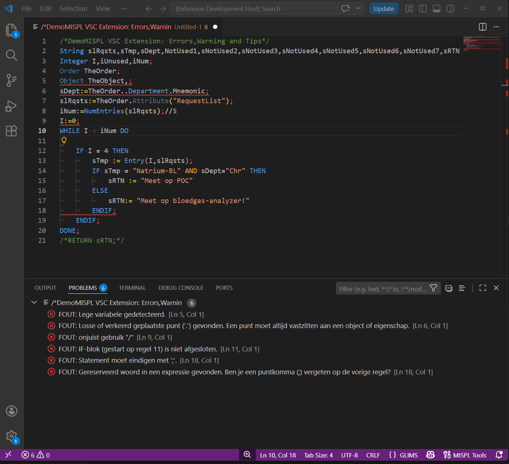

  
<b>💡 IntelliSense (Snippets & Hover)</b>

   
  Beweeg je muis over GLIMS-functies (bijv. <code>AddLogEntry</code>) om direct parametervereisten en documentatie te zien. Gebruik slimme autocomplete-snippets om complexe blokken in seconden te bouwen.  
  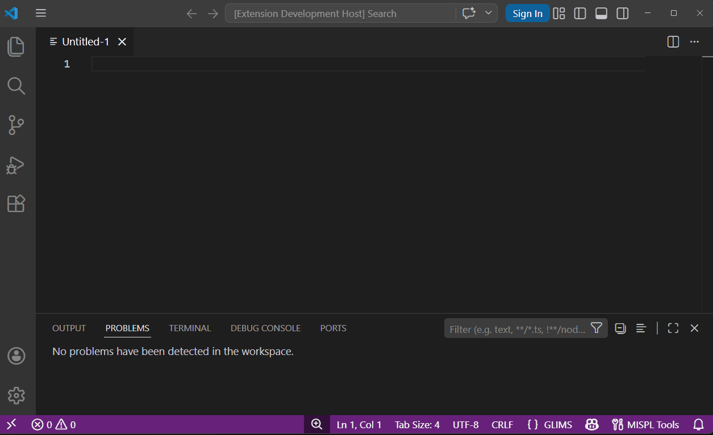

  
<b>🗺️ Code-Map (Outline)</b>

   
  Navigeer eenvoudig door complexe scripts met het Outline-paneel. Bekijk gedeclareerde variabelen per type en spring direct naar specifieke <code>IF</code> en <code>WHILE</code> blokken.  
  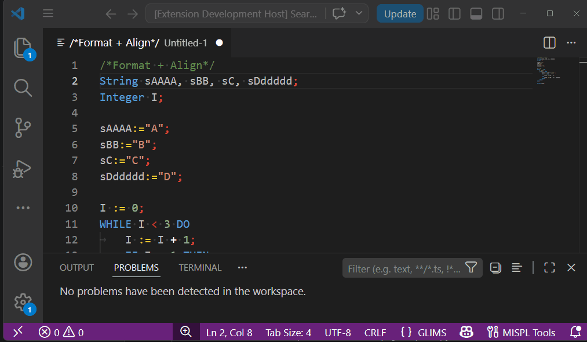

### 🛠️ Refactoring & Formattering
Houd je code schoon, leesbaar en perfect gestructureerd met geautomatiseerde tools.

  
<b>🧹 Ongebruikte Variabelen Verwijderen</b>

   
  Scant automatisch je declaraties en verwijdert chirurgisch de variabelen die nergens in het script worden gebruikt.  
  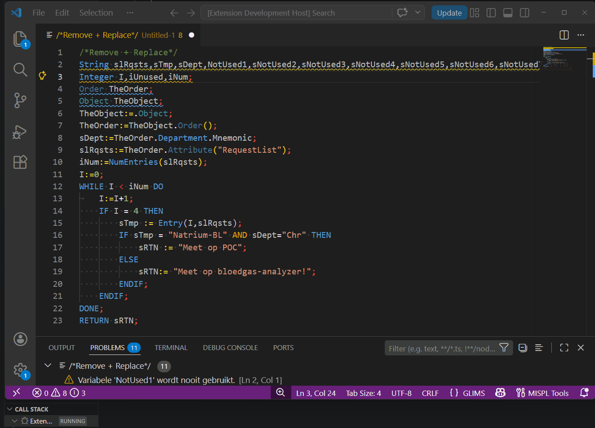

  
<b>📏 Toewijzingen Uitlijnen (Align)</b>

   
  Selecteer een blok code en lijn alle <code>:=</code> operatoren verticaal uit voor maximale leesbaarheid.  
  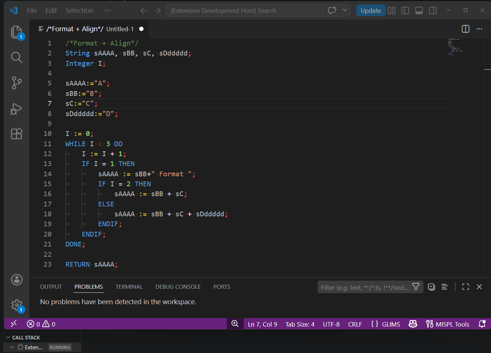

  
<b>📦 Inpakken in Blok (Wrap in Block)</b>

   
  Verpak geselecteerde regels code direct in een <code>IF</code>, <code>WHILE</code> of <code>REPEAT</code> blok met de juiste inspringing (Sneltoets: <code>Ctrl+Alt+W</code>).  
  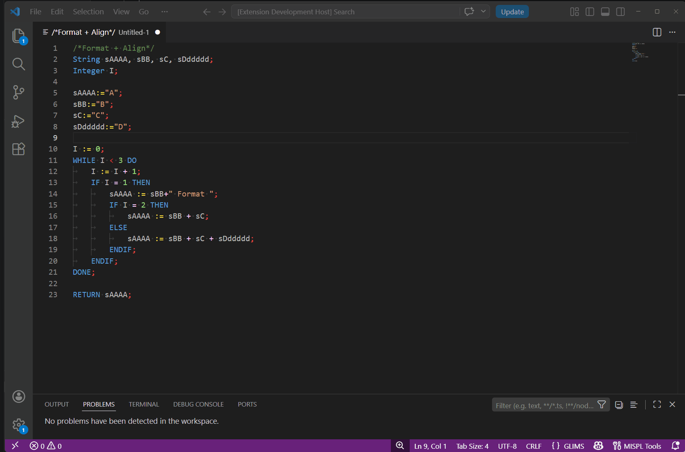

  
<b>✂️ Variabele Extraheren</b>

   
  Selecteer een complexe expressie, klik met de rechtermuisknop en extraheer deze om automatisch een nieuwe variabele te declareren en toe te wijzen bovenaan je script.  
  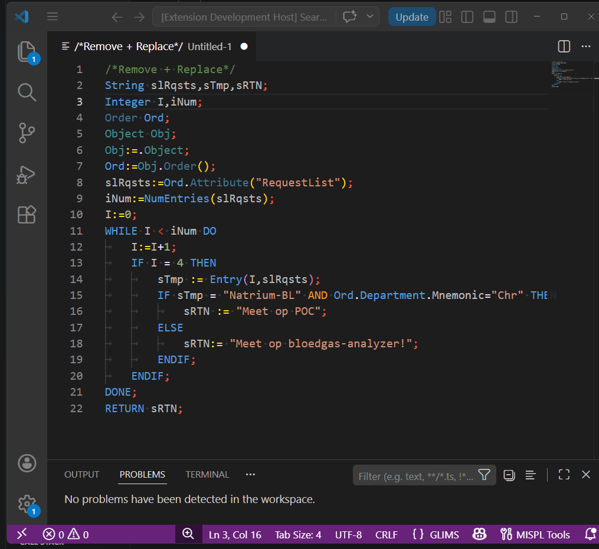

  
<b>📝 Formatteren, Compacten & Minificeren</b>

   
  Formatteer je code perfect, verwijder overbodige witruimte of minificeer je code agressief om onder de GLIMS-limiet van 31.000 tekens te blijven.  
  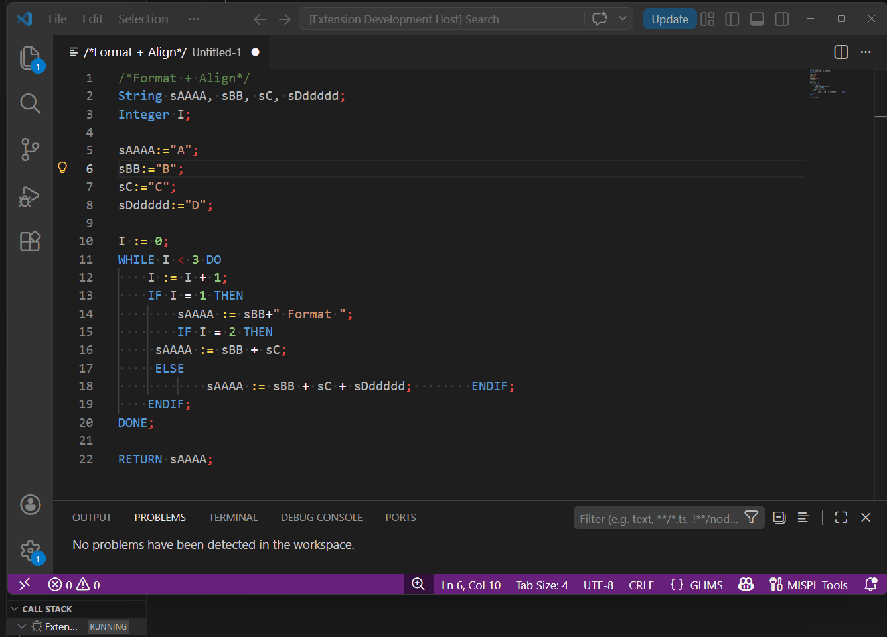 
  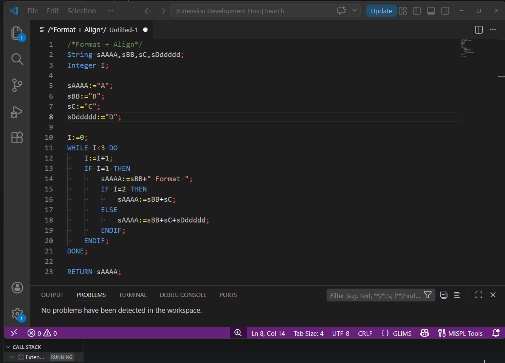 
  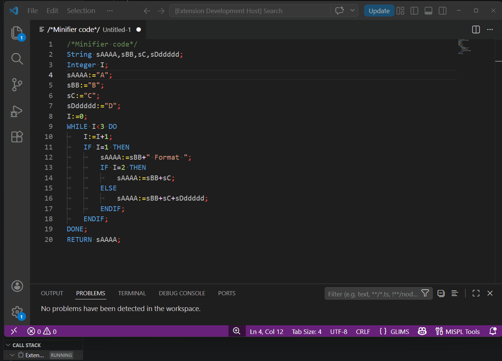

---

## 🧪 Batch Testing (Massale Validatie)

Het overnemen van een database met duizenden verouderde MISPL-scripts is een uitdaging. Deze extensie bevat **Batch Test Tools** om je volledige GLIMS-omgeving in één keer te valideren. 

  
<b>📊 Bekijk de Batch Validatie in actie</b>

   
  <b>Gebruik:</b> 
  1. Exporteer je MISPL-tabel (<code>gp_SiteFunction</code>) uit GLIMS als een <code>.csv</code> bestand. 
  2. Open de Folder ".\mispl\batchTest" in VSC. 
  3. Voer in <code>Terminal</code> de Batch-tool uit via Node.js. 
  4. Gebruik <code>runBatchToExcel.js</code> voor een Excel overzicht van alle Fouten, Waarschuwingen en Stijl-Tips, <code>batchTest.js</code> voor alleen de Fouten, en <code>unitTest.js</code> om de Linter te testen 
  5. De engine parst duizenden scripts in seconden en produceert een rapport met alle fatale crashes en syntaxfouten.  
  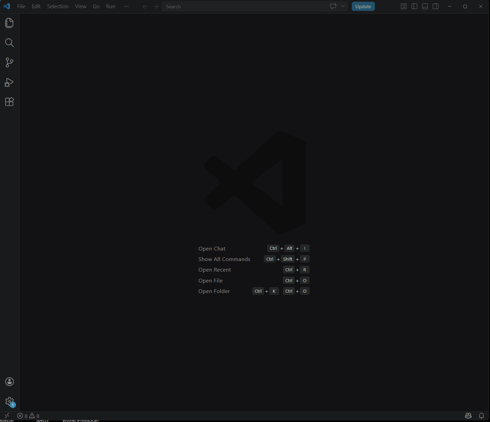

---

## 👣 Runtime Validatie (Kruimelspoor)

Het oplossen van problemen in productie is lastig. De **Validation Flow** functie lost dit op door automatisch breadcrumbs in je code te injecteren.

  
<b>🕵️‍♂️ Dekkingsanalyse (Dead-Code Detectie)</b>

   
  1. <b>Injecteren:</b> De tool injecteert veilig trackingcodes (<code>_sV</code>) op elk logisch kruispunt. 
  2. <b>Uitvoeren:</b> Voer het script uit in GLIMS. Het spoor wordt naar het log geschreven. 
  3. <b>Analyseren:</b> Kopieer de log-string naar VS Code en draai de analyse. Een rapport laat precies zien welke paden zijn doorlopen.  
  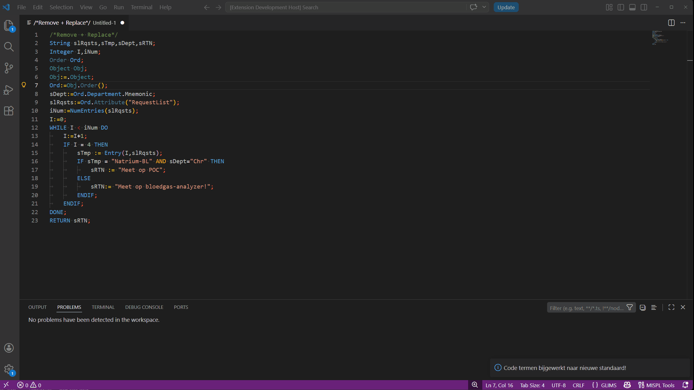

---

## 🌳 Flowcharts & AST Visualisaties

Transformeer je code in visuele logica om complexe scripts te vereenvoudigen voor documentatie of overleg.

  
<b>🔀 Interactieve Flowcharts</b>

   
  Genereer interactieve Mermaid.js-stroomdiagrammen voor je script. Klik op een blok in het diagram om direct naar de bijbehorende regel code te springen.  
  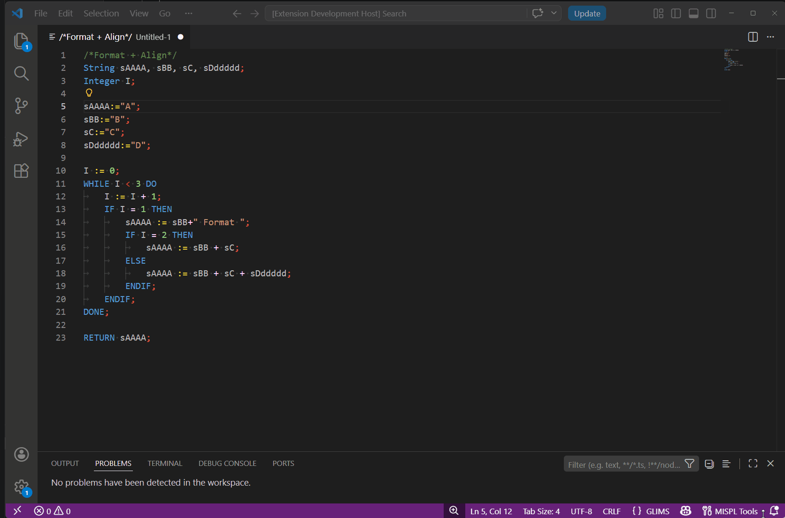

  
<b>🌲 Print AST (Abstract Syntax Tree)</b>

   
  Converteer je MISPL-script naar een schone, hiërarchische boomstructuur die de logica van de parser laat zien.  
  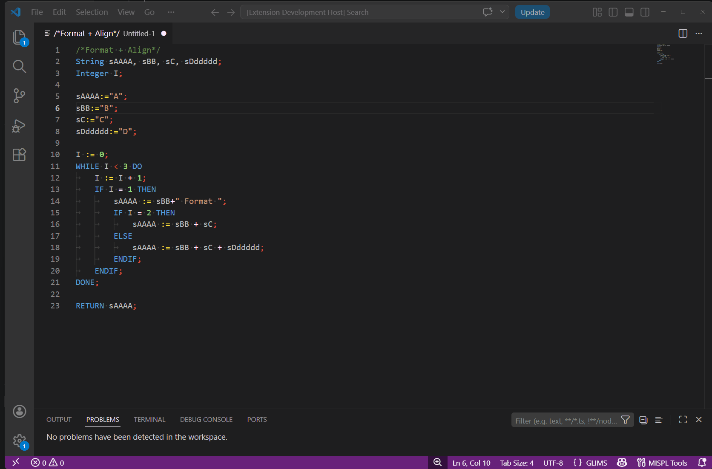

---

## 🕹️ Commando Overzicht

Alle tools zijn snel toegankelijk via het Command Palette (`Ctrl+Shift+P`) of het MISPL Tool Menu (`Ctrl+Alt+M`).

| Commando                             | Beschrijving                                                                 |
| :----------------------------------- | :--------------------------------------------------------------------------- |
| `MISPL: Show Tools Menu`             | Opent een interactief menu met alle beschikbare commando's.                  |
| `MISPL: Extract to Variable`         | Extraheert geselecteerde code naar een nieuwe variabele.                     |
| `MISPL: Insert Magic Debug`          | Injecteert een veilige `Message()` log voor de geselecteerde variabele.      |
| `MISPL: Wrap in IF / WHILE`          | Verpakt geselecteerde regels in een conditioneel of loop-blok.               |
| `MISPL: Align Assignments`           | Lijnt alle `:=` operatoren verticaal uit in de selectie.                     |
| `MISPL: Remove Unused Variables`     | Verwijdert automatisch ongebruikte variabelen uit declaraties.               |
| `MISPL: Compact Code`                | Formatteert code en verwijdert overbodige witruimte.                         |
| `MISPL: Minifier`                    | Minificeert code agressief om database-ruimte te besparen.                   |
| `MISPL: Replace Words...`            | Vervangt woorden op basis van een aangepaste mapping-lijst.                  |
| `MISPL: Show Flowchart`              | Genereert een visueel stroomdiagram van het huidige script.                  |
| `MISPL: Inject Validation Flow`      | Injecteert `_sV` breadcrumbs voor runtime logging.                           |
| `MISPL: Remove Validation Flow`      | Verwijdert veilig alle geïnjecteerde tracking codes.                         |
| `MISPL: Analyze Coverage`            | Vertaalt GLIMS log-output naar een dekkingsrapport.                          |
| `MISPL: Print AST`                   | Genereert een hiërarchische boomstructuur van het script.                    |

---

## 📦 Installatie
1. Open Visual Studio Code.
2. Ga naar de Extensions view (`Ctrl+Shift+X`).
3. Zoek naar **MISPL Language Support**.
4. Klik op **Install**.

## 🐞 Problemen Melden
Help ons de engine te verbeteren! Als je een foutieve melding ziet of een specifiek GLIMS-geval tegenkomt:
1. Stuur een e-mail naar: `d.w.koppenaal@umcutrecht.nl`
2. Voeg een minimaal MISPL-codevoorbeeld toe waarmee het probleem gereproduceerd kan worden.
3. Beschrijf wat het verwachte gedrag is versus wat de linter doet.